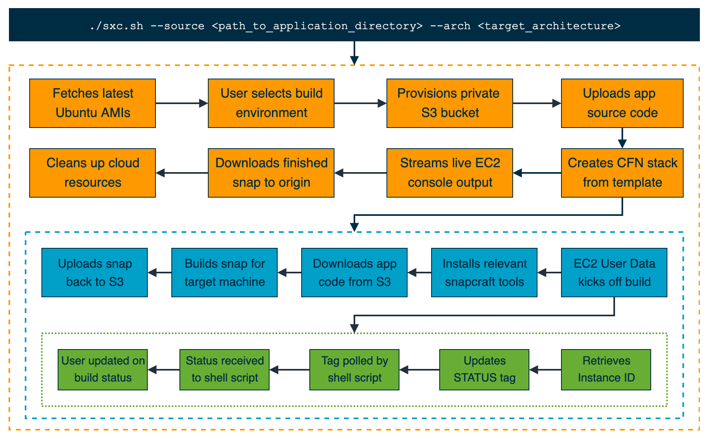
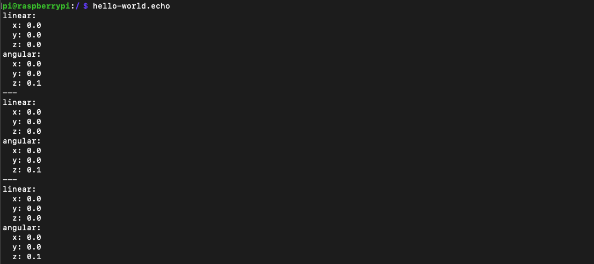

# Snap xCompile
Tool to cross-compile ROS snaps for x86_64 and arm64 machines using AWS.

## Overview
Snap xCompile takes the idea of remote builds and uses a variety of AWS services to build snaps without exposing your source code.

The tool spins up a remote server hosted on AWS, gathers all relevant applications files with their dependencies, executes the snapping process, and fetches the completed snap to the host workstation. The result is a seamless one-step method to cross-compile snaps that requires zero configuration effort from the user.

Currently, Snap xCompile supports snapping for **x86-64** and **arm64** targets.




## Prerequisties
* An [AWS account](https://aws.amazon.com/premiumsupport/knowledge-center/create-and-activate-aws-account/)
* AWS CLI tools [installed](https://docs.aws.amazon.com/cli/latest/userguide/install-cliv2.html) and [configured](https://docs.aws.amazon.com/cli/latest/userguide/cli-configure-quickstart.html) on your workstation


# Example Usage

1. Download the project to your local system.

```
git clone https://github.com/aws-samples/snap-xcompile.git
```

2. Give execution permission to the shell script.

```
cd snap-xcompile/

chmod +x src/sxc.sh
```

3. Snap [example ROS project](examples/ros_hello_world) for the desired target architecture (*arm64* or *x86_64*).

```
./src/sxc.sh --source examples/ros_hello_world/ --arch arm64
```

This step will take several minutes to finish. Go ahead and take that much-needed break in the meantime!

[SCREENCAST here]

4. The desired snap will be located in your working directory once the script finishes execution.
```
ls .
```
[SCREENSHOT HERE]


## Test Deployment

1. Transfer snap to your target system.

2. Install snap. Replace **FILENAME** with name of the snap produced by Snap xCompile.
```
sudo snap install --devmode FILENAME.snap
```

3. Invoke **echo** function from the ROS snap.
```
hello-world.echo
```




## Security

See [CONTRIBUTING](CONTRIBUTING.md#security-issue-notifications) for more information.


## License

This library is licensed under the MIT-0 License. See the LICENSE file.
